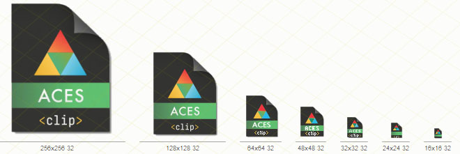
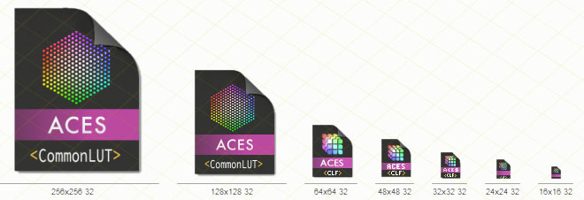

# ACES-fileformat-icons
Icons for the new file formats introduced with the upcoming release of the Academy Color Encoding System (ACES) [specifications](https://github.com/ampas/).

Each filetype icon is available in itw own subfolder, both as single-icon for both Windows (`.ico`) and Apple (`.icns`) file formats. A global icon library (`.icl`) including all of the above is also present in the root folder.

Icons Designed by Walter Arrighetti
Icons with * inspired by an original design by **Frank Jonen**.

Sizes 512×512 down to 16×16 pixels, at 32bits/pixel, 256-colors and 16-colors (EGA palette), with nonlinear scaling of graphic details (“opticals”).

Icons for the following ACES-related file formats are included:

 * **ACESclip** *sidecar* * file (`.ACESclip.xml` extension; specs under review)
 * **ACESclip** *manifest* * file (`.ACESclip.xml` extension), cfr. [`TB-2019-009`, _ACES Clip-level Metadata File Format Definition and Usage_](http://j.mp/TB-2014-009])
 * **CLF** * color lookup table file (CommonLUT Format, `.clf` extension; specs under review)
