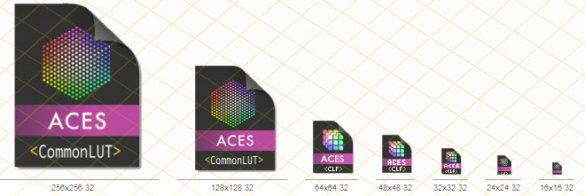

# ACES-fileformat-icons
Icons for the new file formats introduced with the upcoming release of the Academy Color Encoding System (ACES) [specifications](https://github.com/ampas/).

Each filetype icon is available in itw own subfolder, as single-icon format for both Windows (`.ico`) and Apple (`.icns`) file formats. A global icon library (`.icl`) including all of the above is also present in the root folder.
The Adobe *Photoshop* original template (`.psd` format) may also be present.

Sizes 512×512 down to 16×16 pixels, at 32bits/pixel, 256-colors and 16-colors (EGA palette), with nonlinear scaling of graphic details (“opticals”).

Icons for the following ACES-related file formats are included:

 * **ACESclip** *sidecar* file* (`.ACESclip.xml` extension; specs under review)
 * **ACESclip** *manifest* file (`.ACESclip.xml` extension; cfr. specs [`TB-2019-009`](http://j.mp/TB-2014-009)); `.psd` available
 * **CLF** * color lookup table file* (CommonLUT Format, `.clf` extension; specs under review)

Original design and optical-downscale adaptions by Walter Arrighetti.

Icons with * inspired by original sketches by **Frank Jonen**.
